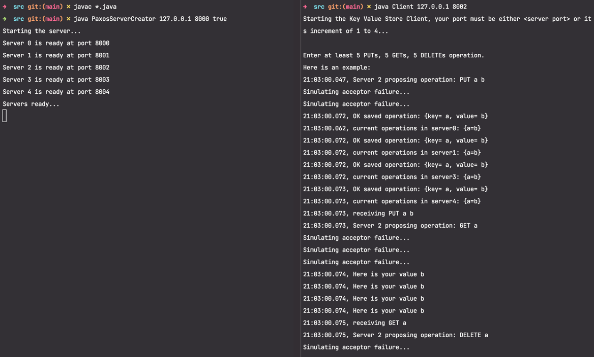

# Multi-thread PAXOS

## How to run?

1. `cd src`
2. To compile `javac *.java`
3. In 2 separate terminals,
   1. `java PaxosServerCreator <IP> <host> <true/false to simulate acceptor failure>`
   2. `java Client <IP> <must be host + (1 to 5)>`

## Sample Output

